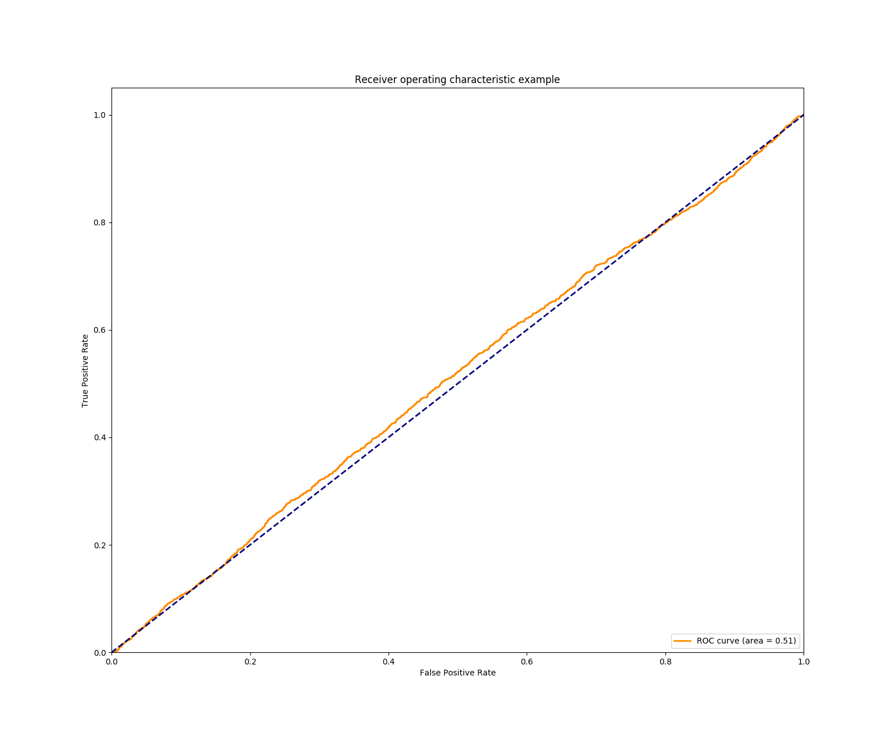
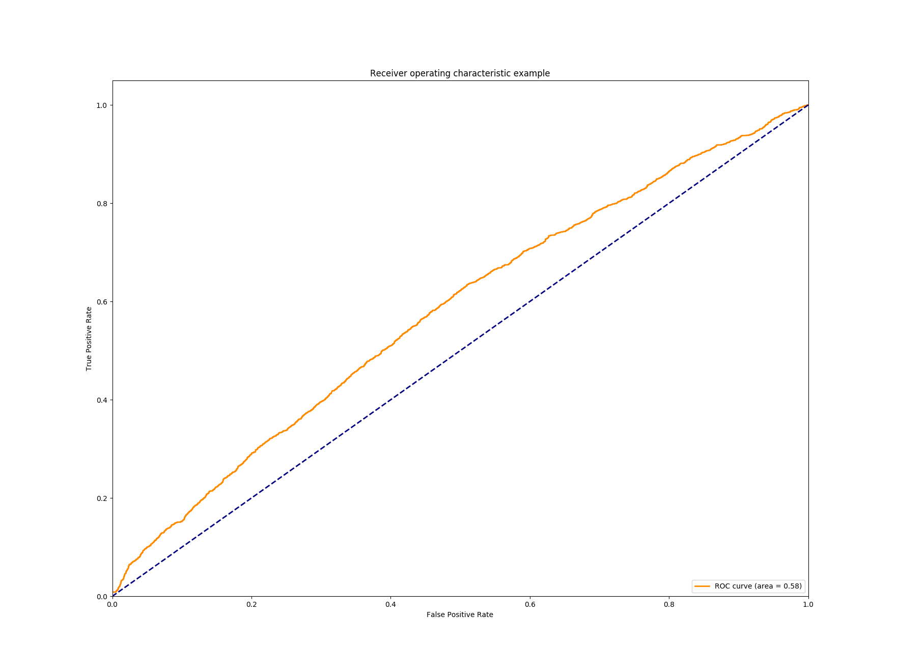
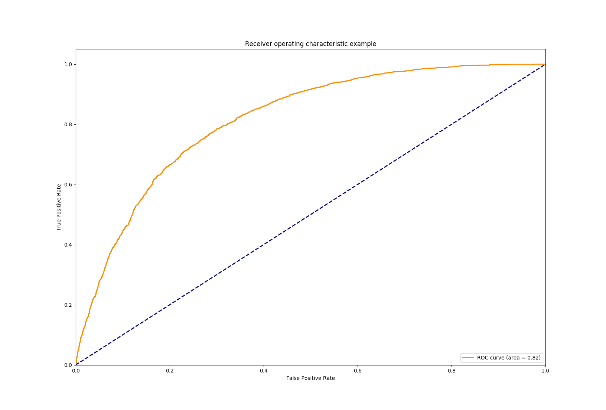

# Comment removal

This repo explores the `comment removal` prediction task using a
sentence embedding mechanism followed by a classifier of choice.

For example encoding the `reddit comments` using
[LASER](https://github.com/facebookresearch/LASER) as inputs to different
classifiers (`mlp`, `svm` or `random forest`).

The focus is on assesing how different embedding choices affect the
classification and little effort is on finding the best classifier or
finetunning the parameters of the classifier.

Additionally the [transformer]() language model with a clasifier head
is also explored.


## Dataset

We use the [Reddit comment removal dataset](https://www.kaggle.com/areeves87/rscience-popular-comment-removal)

### Content
The dataset is a csv of about 30k reddit comments made in `/r/science`
between Jan 2017 and June 2018. 10k of the comments were removed by
moderators; the original text for these comments was recovered using the pushshift.io API.
Each comment is a top-level reply to the parent post and has a comment score of 14 or higher.

The dataset comes from Google BigQuery, Reddit, and Pushshift.io.

### Exploration

In `scripts/expore_dataset.ipynb` there's an overview of the dataset,
class counts, input lengths and a sentiment analysis from a small random sample
grouped by label.

The codebase tries to make little assumptions and not using any specific
hand-crafted features but is helpful to understand the nature
of the data at hand.

## Structure

```bash
# tree -L 3 --dirsfirst -I "*.pyc|*cache*|*init*|*.npy|*.png|*.pkl"
.
├── comment_removal
│   ├── utils
│   │   ├── batchers.py
│   │   ├── loaders.py
│   │   ├── metrics.py
│   │   ├── mutils.py
│   │   ├── plotting.py
│   │   └── text_processing.py
│   ├── encoders.py
│   ├── laser_classifier.py
│   └── transformer_classifier.py
├── data
│   ├── reddit_test.csv
│   └── reddit_train.csv
├── external        # external model checkpoints and modified model definitions
│   ├── models
│   │   ├── LASER           # LASER encoder checkpoints
│   │   ├── transformer     # openAI Transformer checkpoints
│   │   ├── laser.py        # extended LASER model definition
│   │   └── transformer.py  # extended Transformer model definition
│   └── pyBPE          # BPE encoding codebase dependency for LASER encoding
├── results
│   └── test_predictions.csv
├── scripts
│   ├── init_LASER.sh           # Download pyBPE and LASER weights
│   ├── init_transformer.sh     # Download Transformer weights
│   └── explore_dataset.ipynb
├── tests
│   └── test_embeddings.py
├── workdir
├── README.md
├── requirements.txt
└── setup.cfg
```

## How To


### Installation

#### LASER encoder
First download the pretrained models and additional external code:
```bash
    ./scripts/init_LASER.sh
```

Follow the instructions in `external/pyBPE` to install the `pyBPE` tool.

Then, install the python dependencies:
```bash
    pip install -r requirements.txt
```

#### Transformer model

Download the [pre-trained weights](https://github.com/openai/finetune-transformer-lm/tree/master/model):
```bash
    ./scripts/init_transformer.sh
```

### Run

The codebase offers two choices:

1. Embeddings (`LASER`, `LSI`) + a choice of classifiers (`MLP`, `RandomForest`, `SVC`).
2. Transformer model

#### Train

- Training a `MLP` classifier on `LASER`-encoded inputs:

```bash
    python -m comment_removal.laser_classifier train \
            --encoder-type laser \
            --clf-type mlp
```

If you prefer to skip encoding and training, pre-trained models are available.
More specifically:
- `LASER-encoded` inputs + `RandomForest`
- `LASER-encoded` inputs + `MLP`
- `300 dimensional LSI-encoded` inputs + `RandomForest`
- `300 dimensional LSI-encoded` inputs + `MLP`

To download the above:
```bash
    ./scripts/download_LASER_classifiers.sh
```


- Training the `transformer` model:
```bash
    python -m comment_removal.transformer train
```

Alternatively you can open the [ipython notebook](Comment_Removal_Transofrmer.ipynb)
in colab, which is recommended as it is self contained and benefits from GPU acceleration.

This uses the [pre-trained weights](https://github.com/openai/finetune-transformer-lm/tree/master/model)
from openAI implementation loaded into a PyTorch implementation of the model.

#### Eval

To evaluate one of the previously encoded inputs and trained models,
for example `LASER`-encoded inputs and a `Randomforest` classifier:

```bash
    python -m comment_removal.laser_classifier eval \
        --encoder-type laser \
        --clf-type randomforest \
        --predictions-file results/LASER_randomforest_predictions.csv
```
This will try to load the encoded inputs from `workdir/test_laser-comments.npy`
and the model from `workdir/laser_randomforest.npy`


### Results

The codebase compares the following configurations:

#### Embeddings:

* [LSI](https://en.wikipedia.org/wiki/Latent_semantic_indexing):
    - `keep_n` = 10000 words. Without filtering by frequency of appearance

    - `num_topics`: aka number of latent dimensions:
      Two configurations are tested: 300 and 1024.
      Embeddings with 300 latent dimensions perform better but we test with
      1024 too just so we can compare by matching the dimensionality
      of the LASER-encoded inputs and hence the classifier capacity.
      We use the LSI 300 dimensional embeddings as baseline.

* [LASER](https://github.com/facebookresearch/LASER):
    Using a BiLSTM trained on 93 langauges (see original repository).
    Similarly we use the 93 language joint vocabulary and BPE codes.


#### Clasifiers:

* MLP:
    - 3 hidden layers: (1024, 512, 128)
    - ReLU activations units
    - Trained with Adam optimizer
    - Using Early stopping

* RandomForest:
    - Number of estimators: 1000
    - Maximum depth: 100
    - Max features: 100

#### Comparison
1024 dimensions `LSI` embeddings + MLP:


300 dimensions `LSI` embeddings + MLP:


`LASER` embeddings + MLP:


As can be seen using large pre-trained embedding models achieves similar performance as
other baselines found in these
[kaggle kernels](https://www.kaggle.com/areeves87/rscience-popular-comment-removal/kernels)
whilst involving little training and no handcrafted feature extraction.
**Note** that there's no lowercasing, word replacing or any other
type of text processing other than tokenization and BPE encoding for `LASER` embeddings..


## Limitations

The following limitations are acknowledged:

- Configuration flexibility for the embeddings and classifiers
- Proper experimentation logging ([Sacred](https://github.com/IDSIA/sacred) or similar)
- Unit testing
- Code documentation and Typing
